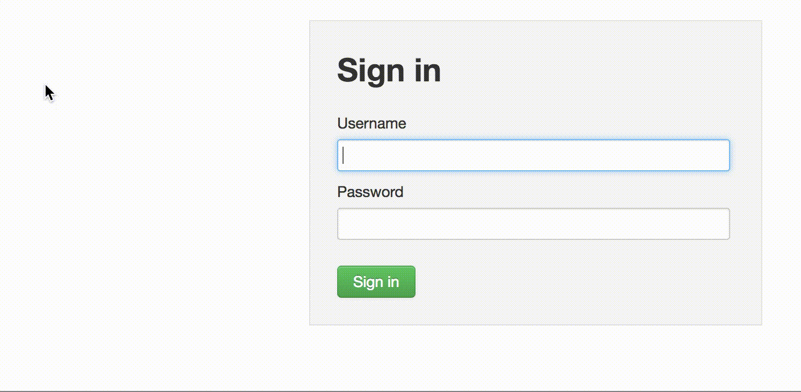

# A collection of utilities for internal GCS trivial automation needs. Details of what it currently does and what is in pipeline are below

<h4>1. Right-click to autofill Ambari webUI with admin/admin

<h4>2. Right-click to Copy the Mac or Linux command to add the hostname/IP pair to the respective hosts files. Click copies the entire command to add the pair to "/Private/etc/hosts" on Mac and in "/etc/hosts" on Linux.

<h4>3. Right-click copy the case directory. You need to specify the directory on your local file system where you would store all the case directories. The format of the case directory is $BASE_PATH/$CASE_NUMBER_$ACCOUNT_NAME_($DETAILS).slice(0,30)
